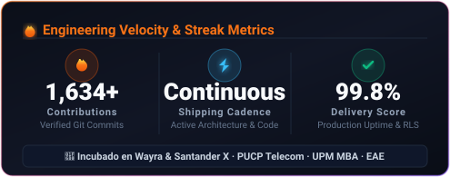
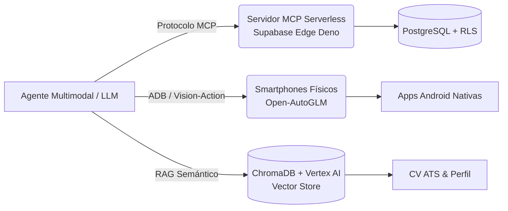

<div align="center">

# 🚀 Jordy Bryan Alania Guadalupe
### **Tech Lead · Solutions Architect · AI & Mobile Engineer**

[](https://pucp.edu.pe)
[](https://upm.es)
[](https://eae.es)
[](https://wayra.com)
[](https://santanderx.com)
[](https://perutechweek.com)
[](https://linkedin.com/in/jordyalania)
[](mailto:jordy.b941901@gmail.com)

```
Lima / Miraflores, Perú 🇵🇪  |  Madrid, España 🇪🇸
```

> **Ingeniero de Telecomunicaciones (PUCP)**, **MBA Internacional (UPM)** y **Máster en Marketing (EAE Business School)**. Especialista en llevar productos de software desde la concepción hasta producción masiva: aplicaciones móviles publicadas en App Store y Google Play, servidores Model Context Protocol (MCP) serverless en el Edge, agentes autónomos visuales, IoT con microcontroladores ESP32 y Facturación Electrónica SUNAT con firma digital criptográfica.

---

</div>


<div align="center">

### ⚡ Métricas Clave de Ingeniería & Arquitectura

<p align="center">
  
  
</p>

| 🟢 Actividad | 📱 Ecosistema Mobile | 🤖 Agentes & MCP | 🔐 FinTech & RegTech |
| :---: | :---: | :---: | :---: |
| **+1,600 Commits**<br/><sub>Contribuciones último año</sub> | **2 Apps en Stores**<br/><sub>Google Play & App Store</sub> | **Serverless Edge MCP**<br/><sub>Deno + Supabase RLS</sub> | **SUNAT UBL 2.1**<br/><sub>Firma Digital XAdES-BES</sub> |

<br/>

<p align="center">
  
  
  
</p>

</div>


## 📌 Tabla de Contenidos
- [🎯 Perfil Ejecutivo](#-perfil-ejecutivo)
- [📱 Proyectos Insignia en Producción](#-proyectos-insignia-en-producción)
- [🚀 Startups, Incubadoras & Ecosistema Emprendedor](#-startups-incubadoras--ecosistema-emprendedor)
- [🤖 Inteligencia Artificial, Agentes & MCP](#-inteligencia-artificial-agentes--mcp)
- [🛠️ Stack Tecnológico y Arquitectura](#️-stack-tecnológico-y-arquitectura)
- [📄 Currículum Vitae](#-currículum-vitae)
- [📬 Contacto](#-contacto)

---

## 🎯 Perfil Ejecutivo

Combino visión estratégica de negocio y rigor técnico de ingeniería para diseñar arquitecturas de software modernas, resilientes y escalables:

- **Ecosistema Mobile**: Apps nativas e híbridas publicadas y aprobadas en **Apple App Store** y **Google Play Store** (Capacitor y Flutter). Manejo de firmas de release (`.jks`, certificados `.p8`, TestFlight), deep linking y notificaciones push críticas de emergencias.
- **AI Engineering & MCP (Top 1% del Mercado)**: Arquitecturas de agentes autónomos, servidores **Model Context Protocol (MCP)** desplegados serverless en **Supabase Edge Functions (Deno)**, pipelines **RAG semánticos con ChromaDB y Vertex AI**, y agentes visuales para celulares (**Open-AutoGLM** con Novita AI vía ADB).
- **Full-Stack & Cloud Serverless**: React 18, Next.js, Vite, Bun, TypeScript, Tailwind CSS, Supabase (PostgreSQL avanzado con Row Level Security exhaustivo y funciones `plpgsql`) y Cloudflare Workers (Wrangler).
- **IoT & Hardware Embebido**: Firmware en C++ con **ESP-IDF** para ESP32/ESP32-S3, streaming de audio digital I2S, WebSockets y síntesis de voz neural offline ultrarrápida con **Piper TTS**.
- **FinTech & RegTech**: Módulo completo de **Facturación Electrónica SUNAT UBL 2.1** con firma digital criptográfica **XAdES-BES** (`node-forge`), comunicación SOAP directa con servidores SUNAT y pasarelas de pago con **Culqi API v2**.
- **Enterprise Low-Code**: 5+ años liderando células técnicas con **OutSystems Reactive Web** (arquitectura de 4 capas y micro-frontends).

---

## 📱 Proyectos Insignia en Producción

### 1. 📲 [Paltarumi (v1.3.9)](https://play.google.com/store) — App Móvil en Stores
- **Tiendas**: Publicada en **Google Play Store** y **Apple App Store**.
- **Stack**: Capacitor, React, TypeScript, Tailwind CSS, Supabase PostgreSQL con RLS.
- **Arquitectura Crítica**: Sistema de notificaciones push prioritarias para **alertas tempranas sismovolcánicas** en tiempo real mediante Firebase Cloud Messaging (FCM payload high-priority) y Apple Push Notification service (APNs).
- **Despliegue**: Gestión de certificados de producción, llaves de firma `.jks`, llaves `.p8` de Apple Developer, TestFlight y Google Play Console.

### 2. 💃 SalsaBachata Platform — App Móvil en Stores
- **Tiendas**: Publicada en **Apple App Store** y **Google Play**.
- **Stack**: Flutter, Dart, Supabase, Provider/Riverpod.
- **Funcionalidad**: Control de asistencias mediante escaneo QR de alta velocidad, acreditaciones masivas en eventos, gestión multi-sucursal y liquidación automática de comisiones a profesores.

### 3. 🌐 OperaPrimaCouch — Servidor MCP Serverless en el Edge
- **Arquitectura**: Servidor **Model Context Protocol (MCP)** desplegado 100% serverless en **Supabase Edge Functions (Deno / TypeScript)**.
- **Innovación**: Permite a agentes de IA (Claude Desktop, Antigravity, Cursor) consultar y operar de forma segura herramientas de bases de datos empresariales con autenticación JWT y políticas RLS sin servidores encendidos 24/7 (escala a cero).

### 4. 🧾 Facturación Electrónica SUNAT UBL 2.1 (Perú)
- **Cumplimiento**: Generación de comprobantes de pago electrónicos (Facturas, Boletas, Notas de Crédito) bajo estándar OASIS UBL 2.1.
- **Criptografía**: Implementación de firma digital **XAdES-BES** con certificados digitales X.509 (`node-forge`).
- **Conectividad**: Clientes SOAP directos para envío a servidores SUNAT (Beta y Producción) y recepción/lectura de Constancias de Recepción (CDRs).

### 5. 🔊 Portero Inteligente & Voice AI Offline (`esp32total`)
- **Hardware**: Microcontroladores ESP32 y ESP32-S3 programados en C++ nativo con el framework **ESP-IDF**.
- **Capacidades**: Audio digital bidireccional I2S, WebSockets y micro-servidor local con **Piper TTS** para síntesis neural de voz offline en milisegundos, modernizando intercomunicadores antiguos con bots de Telegram y apertura remota.

---

---

## 🚀 Startups, Incubadoras & Ecosistema Emprendedor

Experiencia directa en el ecosistema de innovación, formulación de modelos de negocio escalables, aceleración y levantamiento de fondos:

- 🔵 **Wayra (Telefónica Open Innovation)**: Participación en el programa de aceleración de startups tecnológicas de Telefónica, validación de propuesta de valor y escalamiento B2B.
- 🔴 **Santander X**: Competencias y programas globales de emprendimiento tecnológico universitario e innovación empresarial de Banco Santander.
- 🌴 **Peru Tech Week (Vertical Turismo / TravelTech)**: Participación activa con soluciones de transformación digital, automatización de canales hoteleros e inteligencia artificial aplicada al turismo en Perú Tech Week.
- 🏆 **Fondos Concursables & Subvenciones de Innovación**: Elaboración de expedientes técnicos y postulaciones para fondos de innovación abierta y prevención climática (*ProCiencia / Concytec / Orgullo Emprendedor*).

---

## 🤖 Inteligencia Artificial, Agentes & MCP



- **Open-AutoGLM (`mobilemanageauto`)**: Agente Vision-Language Action (VLA) con modelos multimodales (Novita AI / ChatGLM) para operar teléfonos físicos Android autónomamente vía ADB.
- **Motor RAG de CVs (`CV py`)**: Vector store en ChromaDB con embeddings de Google Cloud Vertex AI y chunking semántico jerárquico.
- **Playwright & Browser Automation**: Agentes para bypass de formularios, captura de datos y automatización musical programada en Suno AI (`botmusica`).
- **MCP Ecosystem**: Servidores MCP propios para Supabase Edge, WordPress (`popurri`) y Blender 3D (`blender-mcp`).

---

## 🛠️ Stack Tecnológico y Arquitectura

| Categoría | Tecnologías y Herramientas |
| :--- | :--- |
| **Mobile** | Flutter, Dart, Capacitor, Swift, Android Native, FCM Push, APNs (.p8), Keystores (.jks), TestFlight, Google Play Console |
| **AI & MCP** | Model Context Protocol (MCP), Vertex AI (Gemini), ChromaDB, LlamaIndex, Open-AutoGLM, Novita AI, Qwen Plus, Ollama, Piper TTS |
| **Frontend** | React 18, TypeScript, Bun, Vite, Next.js, Tailwind CSS, TanStack, Shadcn UI, HTML5 / CSS Glassmorphism |
| **Backend & Edge**| Supabase (PostgreSQL, RLS granular, plpgsql, Edge Functions, Realtime), Cloudflare Workers (Wrangler), Node.js, Prisma, Drizzle |
| **IoT & Embebidos**| ESP32, ESP32-S3, C++, ESP-IDF, Audio I2S, WebSockets, Arduino IDE |
| **FinTech & RegTech**| Facturación SUNAT UBL 2.1, Firma Digital XAdES-BES (node-forge), SOAP Client, Culqi API v2, GoldenCheck |
| **Enterprise** | OutSystems Reactive Web (5+ años), Arquitectura 4-Layer Canvas, Telecomunicaciones (PUCP), MBA (UPM) |

---

## 📄 Currículum Vitae

Puedes explorar las versiones detalladas de mi CV en la carpeta [`/cv`](./cv):
- 🇪🇸 **[CV en Español (Completo)](./cv/CV_Jordy_Alania_ES.md)**
- 🇬🇧 **[CV in English (International)](./cv/CV_Jordy_Alania_EN.md)**
- 🇪🇺 **[CV adaptado para España / Europa](./cv/cv_espana.md)**
- 🇵🇪 **[CV adaptado para Perú / LATAM](./cv/cv_peru.md)**
- 🧠 **[Base de Conocimiento y Perfil Maestro](./knowledge/PERFIL_TECNICO_Y_CONOCIMIENTOS_JORDY.md)**

---

## 📬 Contacto

- 💼 **LinkedIn**: [linkedin.com/in/jordyalania](https://linkedin.com/in/jordyalania)
- 📧 **Email**: [jordy.b941901@gmail.com](mailto:jordy.b941901@gmail.com)
- 📍 **Ubicación**: Lima (Miraflores), Perú / Madrid, España

---

<div align="center">
<sub>Diseñado y compilado para GitHub & Digital Twin Ecosystem · 2026</sub>
</div>
